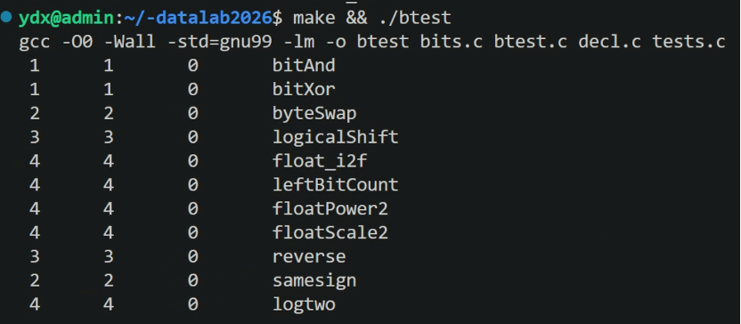
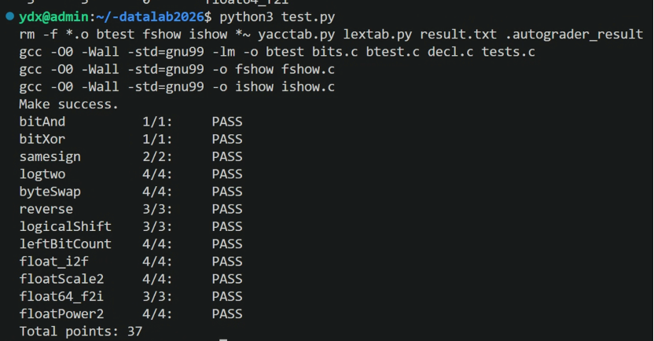

# datalab 报告

姓名：杨鼎铉

学号：2023200224

| 总分 | bitAnd | bitXor | samesign | logtwo | byteSwap | reverse |
|:---:|:---:|:---:|:---:|:---:|:---:|:---:|
| 37 | 1 | 1 | 2 | 4 | 4 | 3 |

| logicalShift | leftBitCount | float_i2f | floatScale2 | float64_f2i | floatPower2 |
|:---:|:---:|:---:|:---:|:---:|:---:|
| 3 | 4 | 4 | 4 | 3 | 4 |

test 截图：





## 解题报告

### 亮点

- **掩码的构建**：lab 中的掩码可以归为三类（取字段、由数据生成、由判断结果生成），见下一节。
- **byteSwap**：利用 `a ^ (a^b) = b`，只构造一个掩码，一次异或就完成两个字节的交换。
- **logicalShift**：用符号位"生成"算术右移多补的那 n 个 1，再异或清除；正数和 `n = 0` 都不用特判，也避开了移位 32 位的未定义行为。
- **logtwo / leftBitCount**：二分查找，并用 `(条件) << k` 把判断结果直接变成累加值和移位量，不需要条件语句。
- **float64_f2i**：只用真实指数 E 的两次比较，就统一处理了下溢、非规格化数、溢出、NaN 和 ∞。

### 掩码的构建

1. **取字段掩码：先右移对齐，再和"宽度为 w 的全 1"相与**，全 1 的值是 `(1 << w) - 1`：

   | 掩码 | 宽度 | 用在哪里 |
   |---|---|---|
   | `1` | 1 位 | reverse：`v & 1` 取最低位 |
   | `0xFF` | 8 位 | byteSwap 取一个字节；float 取阶码 |
   | `0x7FF` | 11 位 | float64_f2i 取 double 阶码 |
   | `0xFFFFF` | 20 位 | float64_f2i 取 uf2 里尾数的高 20 位 |
   | `0x7FFFFF` | 23 位 | float 取尾数 / 去掉隐含的 1 |
   | `1 << 31` / `0x80000000` | 单独第 31 位 | 取符号位；float64_f2i 补上隐含的 1 |

2. **由数据"生成"的掩码**，掩码的位置或长度取决于输入：
   - byteSwap：把差值 d 左移到两个目标字节上，`(d << ns) | (d << ms)`，其余位为 0。
   - logicalShift：`(x & (1<<31)) >> n` 用算术右移的符号扩展得到 n+1 个 1，再 `<< 1` 去掉一个，恰好是要清除的 n 位。

3. **由判断结果生成的"移位量掩码"**：`!`、`>` 的结果只有 0 或 1，左移 k 位后得到 0 或 2^k，可以直接当作累加值和移位量，不需要 if（logtwo、leftBitCount）。

### bitAnd

```c
return ~(~x | ~y);
```

**思路**：按位运算各位互不影响，所以只看一位。两位都为 1，等价于"两位中不存在 0"。用 `~x`、`~y` 表示"该位为 0"，`~x | ~y` 表示"至少有一位为 0"，整体再取反就是"不存在 0"，即 `x & y = ~(~x | ~y)`。

**关键技巧**：德摩根定律，把"与"转成"或"。

### bitXor

```c
return ~(~x & ~y) & ~(x & y);
```

**思路**：

1. 异或的含义是"两位不同"，拆成两个条件同时成立：至少有一位为 1（`x | y`），且两位不同时为 1（`~(x & y)`）。所以 `x ^ y = (x | y) & ~(x & y)`。
2. 题目不允许用 `|`，再用德摩根定律把 `x | y` 改写成 `~(~x & ~y)`，得到 `~(~x & ~y) & ~(x & y)`。

**关键技巧**：先把异或拆成"或"和"与非"两个条件，再用德摩根定律消掉被禁用的运算符。

### samesign

```c
return !((x ^ y) >> 31);    /* 两数都非 0 时，只比较符号位 */
```

**思路**：

1. 题目把 0 单独算一类，所以有负、零、正三种情况，不能只比较符号位：0 和正数的符号位都是 0，直接比较会把 `samesign(0, 1)` 判成同号。
2. 先处理 0：用 `!x`、`!y` 判断，只要有一个是 0，就只有两个都为 0 时才返回 1。
3. 两数都不为 0 时只剩正负两类，比较符号位即可：`x ^ y` 的最高位为 0 表示符号相同；算术右移 31 位后得到 0（同号）或 -1（异号），再用 `!` 变成 1 或 0。

**关键技巧**：先异或再移位，只需要一次移位就能比较两个符号位。

### logtwo

```c
s = ((v >> 8) > 0) << 3;  v = v >> s;  r = r | s;   /* 二分的一步 */
```

**思路**：

1. 对正整数 v，⌊log₂v⌋ 就是最高位 1 所在的位序号，所以问题变成"找最高位的 1"。
2. 逐位扫描太慢，改用二分查找：先看高 16 位里有没有 1。有，说明最高位至少在第 16 位，答案加 16，并把 v 右移 16 位，让高半部分降下来继续找；没有，答案不变，直接在低 16 位里找。
3. 再依次对 8、4、2、1 位做同样的判断。16+8+4+2+1 = 31，5 步就能覆盖 0~31 的所有位序号。

**关键技巧**：

- `(v >> 16) > 0` 的结果只有 0 或 1，左移 4 位就是 0 或 16，同时作为这一步的累加值和移位量，不需要 if。
- 每步累加的 16、8、4、2、1 在二进制里各占一位、互不重叠，可以用 `|` 代替题目不允许的加法。
- 判断时写 `v >> 16 > 0`，不写 `v > 0xFFFF`，避免使用大常数。

### byteSwap

```c
d = ((x >> ns) ^ (x >> ms)) & 0xFF;
return x ^ ((d << ns) | (d << ms));
```

**思路**：

1. 第 k 字节从第 8k 位开始，所以 `n << 3`、`m << 3` 就是两个字节的起始位。
2. 常规做法要"取出两个字节 → 清空原位置 → 交叉写回"三步。这里利用异或：设两个字节为 a、b，令 `d = a ^ b`，则 `a ^ d = b`，`b ^ d = a`，同一个 d 可以同时完成两个方向的替换。
3. 构造掩码：把 d 放到两个字节的位置上，其余位为 0；原数和它异或一次，两个字节就互换了，其他字节因为异或 0 保持不变。

**关键技巧**：

- 异或交换，只需要一次异或。
- 先把两次右移的结果异或，再统一 `& 0xFF`，不用分别取出两个字节。
- `n == m` 时 d = 0，结果自然是原数，不用特判。

### reverse

```c
r = (r << 1) | (v & 1);     /* 循环体，固定执行 32 次 */
```

**思路**：

1. 逐位搬运：每次用 `v & 1` 取出 v 的最低位，放到结果 r 的最低位；放之前 r 先左移一位腾出空间，放完后 v 右移一位丢掉这一位。
2. 最先取出的第 0 位，在后面 31 次左移中被逐步推到最高位；最后取出的第 31 位留在最低位，整体就反转了。
3. 循环固定执行 32 次。题目没有 `<` 和 `++`，所以计数器从 32 开始递减，用 `while (i)` 判断。

**关键技巧**：不能用"v 变成 0"作为结束条件。v 的高位是 0 时会提前退出，已经搬过去的位没有被推到正确位置，例如 `reverse(1)` 会得到 1，而不是 `0x80000000`。

### logicalShift

```c
((x & (1 << 31)) >> n) << 1  /* 多补的 n 个 1 */
```

**思路**：

1. 对 int 做右移是算术右移，高位补符号位；逻辑右移高位一律补 0。两者只在 x 为负时不同：算术右移会在高 n 位多补 n 个 1。
2. 所以只要把"多补的 n 个 1"精确地构造出来，再和 `x >> n` 异或清除。
3. 构造方法：`x & (1 << 31)` 只保留符号位；把它算术右移 n 位，得到 n+1 个 1（原符号位加上补进来的 n 个）；再左移一位去掉原符号位那一个，剩下的正好是多补的 n 个 1。

**关键技巧**：

- 掩码由符号位生成：x 为正时掩码自动为 0，不需要分支。
- `n = 0` 时符号位在最后左移时被移出，掩码也为 0，结果正确。
- 没有用 `~0 << (32 - n)` 构造掩码，因为 `n = 0` 时要移位 32 位，属于未定义行为。

### leftBitCount

```c
s = !(x >> 16) << 4;  x = x << s;  n = s;   /* 二分的一步 */
return n + !x;                             /* 全 1 时补成 32 */
```

**思路**：

1. 先把 x 取反，"数最高位开始的连续 1"就变成"数前导 0"。这样每一步只需要判断 `!(x >> k)`，也就是高若干位是否全为 0。
2. 用和 logtwo 一样的二分：高 16 位全为 0，说明前导 0 至少有 16 个，计数加 16，并把 x 左移 16 位，把已经数过的 0 移出去；否则计数不变、x 不动，在当前范围内继续细分。依次判断 16、8、4、2、1 位。
3. 五步加起来最多只能数到 31。原数全为 1 时，取反后 x 为 0，实际应为 32，所以最后再加上 `!x`：此时 `!x` 为 1；其他情况下 x 中一定有 1，而左移只会移走前导 0，这个 1 不会被移出，`!x` 为 0，不影响结果。

**关键技巧**：

- 取反，把"数 1"转成"数 0"，判断更简单。
- 最后用 `+ !x` 修正全 1 这一种边界情况。

### float_i2f

```c
if ((rnd > 0x80) | ((rnd == 0x80) & frac)) frac = frac + 1;  /* 向偶数舍入 */
return sign + (e << 23) + frac;                             /* 用 + 保留进位 */
```

**思路**：本题要手工完成 int → float，要做的是确定符号、计算阶码、提取尾数、处理舍入。

1. **特判 0**：0.0 的位表示是全 0，而且下面的规格化循环遇到 0 不会终止，要单独返回。
2. **分离符号**：取 x 的最高位作为符号位；负数取绝对值，后面只处理大小。
3. **规格化，同时算阶码**：不断左移，直到最高位（第 31 位）为 1，这时数值可以看作 1.xxx × 2^31。不需要左移时，阶码是 31 + 127 = 158；每左移一次，说明原数最高位低一位，阶码减 1。
4. **提取尾数**：规格化后，第 31 位是隐含的 1，第 30~8 位就是 23 位尾数，第 7~0 位是放不下、要舍掉的部分。`(a >> 8) & 0x7FFFFF` 取尾数，同时去掉隐含的 1。
5. **舍入**：舍掉的低 8 位记为 rnd，"一半"是 0x80。按向偶数舍入：rnd > 0x80 进位；rnd < 0x80 直接截断；rnd == 0x80 时，只有尾数末位为 1（奇数）才进位。
6. **拼接**：符号位 + 阶码左移 23 位 + 尾数。

**关键技巧**：拼接用加法而不是 `|`。尾数全为 1 时再进位会溢出到第 23 位，加法会把这个进位自动加到阶码上、尾数变成 0，对应 1.11…1 进位成 10.00…0、指数加 1；用 `|` 会丢掉这个进位。

### floatScale2

```c
frac = frac << 1;                                          /* 非规格化 */
if (frac >> 23) { exp = 1; frac = frac & 0x7FFFFF; }
if (exp == 0xFF) frac = 0;                                 /* 规格化溢出为 ∞ */
```

**思路**：2f 就是指数加一，但三类浮点数表示指数的方式不同，所以先取出阶码，再分四种情况处理，最后把三个字段拼回 32 位。

1. **阶码为 255（NaN 或 ∞）**：乘 2 后不变，直接返回原值。
2. **阶码为 0（非规格化数）**：指数固定是 -126，不能靠改阶码实现乘 2，只能把尾数左移一位。如果左移后进位到了第 23 位，就把阶码置为 1、尾数去掉溢出的那一位。这时结果正好是最小的规格化数，因为 IEEE754 保证了最大非规格化数和最小规格化数是连续的。
3. **阶码为 254**：加 1 后变成 255，已经超出范围，应该返回同号的 ∞，所以尾数必须清零；否则保留原尾数会得到 NaN。
4. **阶码为 1~253**：只把阶码加 1，符号和尾数不变。

**关键技巧**：

- 字段的"拆"和"拼"都有固定写法：拆是"右移到起始位 + 等宽全 1 掩码"，拼是"左移到起始位 + 按位或"。三个字段的位置不重叠，用 `|` 拼接不会互相干扰。
- 另一种写法（查资料时看到的）是把 32 位当成整体：规格化数直接 `uf + 0x800000`，因为阶码最低位的权值正好是 2^23；非规格化数用 `s | (uf << 1)`，进位自然落进阶码。这种写法更短，但进位关系是隐含的。提交的写法把每一次进位都显式写出，每一步都能和 IEEE754 的定义对上，更方便逐条验证。

### float64_f2i

```c
m = (1 << 31) | ((uf2 & 0xFFFFF) << 11) | (uf1 >> 21);  /* 1.frac × 2^31 */
r = m >> (31 - E);                                      /* 截断小数 */
```

**思路**：double 有 64 位，题目把它拆成两个参数：uf2 是高 32 位（符号 1 位、阶码 11 位、尾数高 20 位），uf1 是低 32 位（尾数低 32 位）。只用绝对值计算，最后再统一加符号。

1. **取符号和指数**：符号是 uf2 的第 31 位；阶码在 uf2 的第 30~20 位，右移 20 位后 `& 0x7FF`，减去偏置 1023，得到真实指数 E。|x| 落在 2^E 和 2^(E+1) 之间。
2. **用 E 处理边界**：
   - E < 0：|x| < 1，向零截断后是 0。±0 和非规格化数的 E 是 -1023，也走这条分支。
   - E > 30：|x| ≥ 2^31，超出 int 范围，返回 `0x80000000`。NaN 和 ∞ 的 E 是 1024，也走这条分支。-2147483648.0 的 E 是 31，也会走溢出分支，但 `0x80000000` 正好就是它的补码，结果依然正确。
3. **把尾数拼成 32 位整数 m**：隐含的 1 放在第 31 位，uf2 的低 20 位左移 11 位放在第 30~11 位，uf1 的高 11 位放在第 10~0 位。m 表示 1.frac × 2^31；uf1 剩下的低 21 位是更小的小数位，反正要截断，直接丢掉。
4. **定位小数点**：要的是 1.frac × 2^E，比 m 小 2^(31-E) 倍，所以 `m >> (31 - E)`。移出去的低位就是小数部分，直接丢掉，正好实现向零截断。E 已经限制在 0~30，移位量是 1~31，不会越界。
5. **恢复符号**：符号位为 1 时取相反数。

**关键技巧**：

- 只用 E 的两次比较，就把下溢、非规格化数、溢出、NaN、∞ 全部覆盖。
- 尾数分在两个参数里，拼接时要算清楚每一段放在哪几位。
- 必须先按绝对值截断、最后再取负：负数直接算术右移是向负无穷取整，-13.75 会得到 -14，而题目要求向零舍入，应得 -13。

### floatPower2

```c
return (x + 127) << 23;    /* 规格化 */
return 1 << (x + 149);     /* 非规格化 */
```

**思路**：2 的整数次幂有效数字恰好是 1，规格化时尾数全为 0，非规格化时尾数里只有一位是 1。所以不需要任何计算，只要判断 x 在哪个区间，把"那个唯一的 1"放到正确的位置。

1. **x > 127**：超出最大指数，返回 +∞（`0x7F800000`）。
2. **-126 ≤ x ≤ 127，规格化数**：尾数全 0，令 阶码 - 127 = x，即阶码 = x + 127，左移 23 位放进阶码字段。阶码只能取 1~254，对应的正是这个 x 范围。
3. **-149 ≤ x ≤ -127，非规格化数**：值为 0.frac × 2^(-126)。尾数第 k 位代表 2^(k-23)，乘上 2^(-126) 就是 2^(k-149)。令它等于 2^x，得 k = x + 149，所以返回 `1 << (x + 149)`。k 的范围是 0~22，对应的正是这个 x 范围。
4. **x < -149**：比最小的非规格化数 2^(-149) 还小，返回 0。

**关键技巧**：

- 149 = 23 + 126：23 来自尾数宽度，把"第 k 位"换算成权值 2^(k-23)；126 来自非规格化数固定的指数 -126。
- 判断要从大到小排：先排除 x > 127，否则阶码会溢出到符号位；先确保 x ≥ -149，否则移位量为负，属于未定义行为。每个判断只要写一侧边界，另一侧由前面的判断保证。

## 反馈/收获/感悟/总结

**感悟**

这个 lab 是在中秋假期做的。刚开始有点无所适从：看到"只能用 `~` 和 `|`""不许用 if"这种限制，完全不知道从哪下手；浮点题更是连格式都要重新翻书，写出来的代码经常在边界上挂掉，只能对着 btest 的报错一个个猜。

做了几道之后慢慢找到了固定的方法：

- 位运算题先只看"一位"会怎样，再推广到 32 位。
- 需要判断时，先想能不能把 0/1 的结果直接拿去移位或做掩码。
- 找最高位、数前导 0 这类问题，就用二分。
- 浮点题一律"拆字段 → 按阶码分类 → 修改 → 拼回"，先把 0、非规格化数、NaN/∞、溢出这几类边界列出来，再写主干。

有了这套方法以后，后面几道浮点题反而比前面的整数题做得顺。

**收获**

1. **对数据表示理解更深了**：以前只知道 float 有符号、阶码、尾数三段，这次亲手做了 int ↔ float、double → int 的转换，才真正理解隐含位、偏置、非规格化数为什么要这样设计，以及舍入和截断发生在哪一步。
2. **掌握了一套位运算工具**：
   - 掩码：取字段用"右移 + 全 1 掩码"，拼字段用"左移 + 按位或"。
   - 异或：可以判断相等、翻转指定位、一次完成交换。
   - 逻辑值当数用：`!`、`==` 的结果只有 0 或 1，可以直接参与运算，代替条件语句。
3. **更重视边界和未定义行为**：移位量 ≥ 32、负移位量、有符号数右移向负无穷取整等问题，平时写代码不会注意，这次好几道题都是因为它们才换了写法。以后写底层代码会先想清楚边界再动手。
4. **学会了用测试驱动调试**：先用 btest 看具体哪个输入出错，再手算这个输入每一步的位模式，比盯着代码空想高效得多。

## 参考的重要资料

- CS:APP 第 2 章：整数表示、IEEE754 浮点格式。
- [Bit Twiddling Hacks](https://graphics.stanford.edu/~seander/bithacks.html)：常见位运算技巧。
- [Single-precision floating-point format - Wikipedia](https://en.wikipedia.org/wiki/Single-precision_floating-point_format)
- [Float Toy](https://evanw.github.io/float-toy/)：在线逐位查看浮点数，用来验证边界情况。
